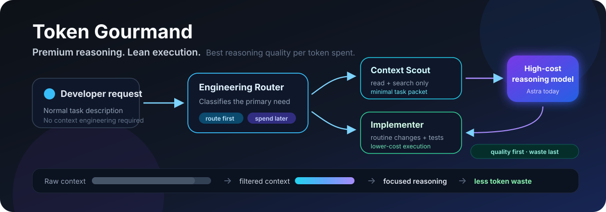
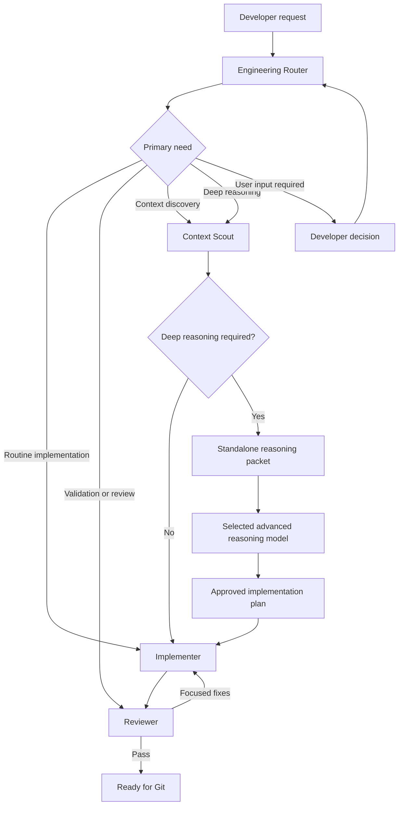

# Token Gourmand

<p align="center">
  
</p>

**Premium reasoning. Lean execution.**

Token Gourmand is a model-agnostic AI engineering workflow for improving engineering quality per premium reasoning token. It exists to keep expensive reasoning focused on architecture, difficult debugging, security-sensitive decisions, and other work where it materially improves the result, while routing discovery, implementation, and review to the smallest capable agent.

> **Use premium reasoning where it creates premium value. Delegate everything else to the smallest capable agent.**

It optimizes quality per premium reasoning token, not token count alone: reasoning quality, correctness, context efficiency, implementation cost, and verification quality all matter.

## Supported ecosystems

- **GitHub Copilot** — native custom agents and handoffs
- **OpenAI Codex** — repository instructions through `AGENTS.md`
- **Claude Code** — repository instructions through `CLAUDE.md`
- **External reasoning models** — compact standalone reasoning packets

## Model-agnostic architecture

The workflow has one shared instruction layer and small adapters for tools that use different repository instruction formats:

```text
.ai/ shared core
  |
  +-- GitHub Copilot adapter: .github/copilot-instructions.md + .github/agents/
  +-- OpenAI Codex adapter: AGENTS.md
  +-- Claude Code adapter: CLAUDE.md
  +-- External reasoning model: standalone reasoning packet
```

`.ai/CORE.md` is the source of truth for operating principles, the need taxonomy, context efficiency, escalation, and the separation between routine execution and advanced reasoning. `.ai/roles/` contains one neutral contract per workflow role. `.ai/PROJECT_CONTEXT.md` stores concise stable facts about the current project. `.ai/REASONING_PACKET.md` defines the portable packet used when difficult reasoning is justified.

Adapters identify the shared files that their host should consume. They do not copy or redefine the workflow.

## Core workflow



The canonical sequence is:

`Engineering Router -> Context Scout -> Implementer -> Reviewer`

The Router may send a clear routine request directly to Implementer or an existing change directly to Reviewer. A large task is not automatically a deep-reasoning task; large but mechanical work stays with Implementer.

## Need taxonomy

- `NEEDS_ROUTINE_IMPLEMENTATION` — the requested change or approved plan is clear.
- `NEEDS_CONTEXT_DISCOVERY` — the relevant implementation, behavior, dependencies, or scope must be discovered.
- `NEEDS_DEEP_REASONING` — a material architecture, security, state, migration, cross-component, or difficult root-cause decision remains.
- `NEEDS_VALIDATION_OR_REVIEW` — an implementation or diff exists and needs focused verification.
- `NEEDS_USER_INPUT` — a required product, policy, environment, or business decision cannot be derived safely.

## Roles

### Engineering Router

Classifies the request and selects the shortest capable path. It does not implement changes.

### Context Scout

Performs read-only, progressive discovery. It produces either enough focused context for routine work or a compact standalone reasoning packet.

### Implementer

Executes a clear request or approved plan with a small coherent diff and targeted validation. It does not redesign settled architecture.

### Reviewer

Checks the result for correctness, regressions, security, compatibility, required behavior, validation, and unnecessary scope without editing files.

## Supported adapters

| Consumer | Repository entry point | Native integration | Token Gourmand convention |
| --- | --- | --- | --- |
| GitHub Copilot | `.github/copilot-instructions.md` and `.github/agents/*.agent.md` | Repository instructions and custom-agent profiles; supported clients can expose configured tools and handoffs. | Agent bodies refer to the neutral core and role contracts. |
| OpenAI Codex | `AGENTS.md` | Codex discovers repository `AGENTS.md` instructions. | Roles are explicit stages in the current session unless the host supplies its own orchestration. |
| Claude Code | `CLAUDE.md` | Claude Code loads `CLAUDE.md` and its local `@path` imports. | Roles are explicit stages in the current session unless the host supplies its own orchestration. |
| External reasoning model | Completed reasoning packet | No repository integration is assumed. | The user or host transfers only the standalone packet and returns the resulting plan to Implementer. |

Native behavior varies by client. In particular, Copilot handoff metadata is a client capability and is not available in every Copilot environment. The shared Markdown contracts define consistent behavior but cannot enforce tool permissions or transitions in a host that does not support them.

## How each adapter consumes Token Gourmand

### GitHub Copilot

Start with the **Engineering Router** custom agent when the path is not already clear. Its existing handoffs route to Context Scout, Implementer, or Reviewer. Each custom-agent profile keeps its Copilot-specific frontmatter and points to the matching shared contract under `.ai/roles/`.

### OpenAI Codex

Codex reads the root `AGENTS.md`, which directs it to the shared core and project context. Codex reads the applicable role contract before performing a stage and carries the stage output into the next role.

### Claude Code

Claude Code reads the root `CLAUDE.md`. That adapter imports the shared core and project context, then directs Claude to load only the role contract needed for the current stage.

### External advanced reasoning models

When Context Scout returns `NEEDS_DEEP_REASONING`, send the completed reasoning packet to the selected advanced reasoning model. The packet includes verified facts, relevant excerpts, constraints, unknowns, the decision required, and definition of done. Return the accepted decision and plan to Implementer.

Do not give an external model the whole repository by default, and do not ask it to spend time on routine editing, formatting, basic checks, or Git housekeeping.

## Project context

Keep `.ai/PROJECT_CONTEXT.md` short and current. Record only stable facts that save repeated discovery: purpose, major architecture, important paths, durable constraints, important decisions, current state, and known boundaries. Verify facts that are critical to a task against the current implementation.

When using this repository as a template, replace the existing Token Gourmand-specific context with the target project's stable facts. Do not turn the file into a second README or a work log, and never store secrets in it.

## Repository structure

```text
.ai/
  CORE.md
  PROJECT_CONTEXT.md
  REASONING_PACKET.md
  roles/
    engineering-router.md
    context-scout.md
    implementer.md
    reviewer.md
.github/
  agents/
    engineering-router.agent.md
    context-scout.agent.md
    implementer.agent.md
    reviewer.agent.md
  copilot-instructions.md
AGENTS.md
CLAUDE.md
README.md
```

## Getting started

1. Create a repository from this template.
2. Replace `.ai/PROJECT_CONTEXT.md` with concise stable facts about the project.
3. Use the native entry point for Copilot, Codex, or Claude Code.
4. Start with Engineering Router unless the required role or an approved plan is already explicit.
5. If Context Scout assigns `NEEDS_DEEP_REASONING`, send only its completed packet to the selected reasoning model.
6. Return the approved plan to Implementer, then send the implementation to Reviewer.

## Model access and tooling

Token Gourmand is a set of repository instructions and workflow conventions. It does **not** install GitHub Copilot, OpenAI Codex, Claude Code, Astra, GPT-5.6, or any other model or client. It does **not** provide accounts, subscriptions, API keys, licenses, credentials, model access, or cross-provider orchestration. Users must obtain and configure the tools and models they choose to use.

The template has no runtime, cloud, language, framework, CLI, generator, or package dependency. Technology-specific instructions belong in repositories created from it.

## Status

Token Gourmand is an early experimental template. Its stable architectural boundary is the shared `.ai/` core with lightweight host adapters. Future changes should be guided by measured context savings, reasoning cost, implementation rework, and engineering quality.
